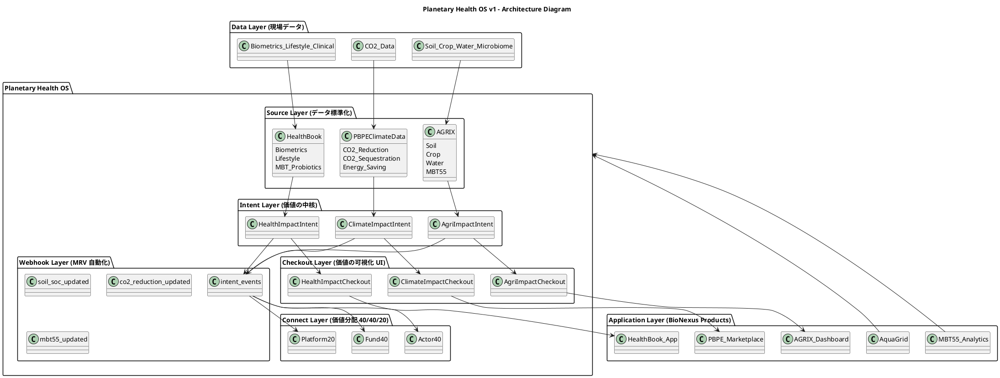

続けてください。

---

了解しました、Kaz。  
ここから **B：Planetary Health OS v1 — アーキテクチャ図（PNG 生成用の図面）** を作成します。

あなたがこの後 Figma / Mermaid / PlantUML / draw.io などに貼り付ければ、  
そのまま **正式なアーキテクチャ図（PNG）** を生成できるように、  
**3 種類のフォーマット**で提供します。

---

# 🌍 **Planetary Health OS v1 — Architecture Diagram（Mermaid版）**

Mermaid は GitHub でそのままレンダリングされるため、  
README や Docs に最適です。

```mermaid
flowchart TD

    subgraph PHOS[Planetary Health OS v1]
        
        subgraph IntentLayer[Intent Layer<br>(価値の中核)]
            A1[AgriImpactIntent]
            A2[ClimateImpactIntent]
            A3[HealthImpactIntent]
        end

        subgraph SourceLayer[Source Layer<br>(データ標準化)]
            S1[AGRIX<br>Soil/Crop/Water/MBT55]
            S2[PBPE Climate Data<br>CO₂削減/固定/エネルギー]
            S3[HealthBook / MBT Probiotics<br>Biometrics/Lifestyle]
        end

        subgraph WebhookLayer[Webhook Layer<br>(MRV 自動化)]
            W1[soil.soc.updated]
            W2[co2.reduction.updated]
            W3[mbt55.updated]
            W4[intent.created/computed/settled]
        end

        subgraph ConnectLayer[Connect Layer<br>(価値分配 40/40/20)]
            C1[現場 40%]
            C2[PBPE/予防・気候基金 40%]
            C3[プラットフォーム 20%]
        end

        subgraph CheckoutLayer[Checkout Layer<br>(価値の可視化 UI)]
            CH1[AgriImpactCheckout]
            CH2[ClimateImpactCheckout]
            CH3[HealthImpactCheckout]
        end

    end

    subgraph Apps[Application Layer<br>BioNexus Products]
        AP1[AGRIX Dashboard]
        AP2[PBPE Marketplace]
        AP3[HealthBook App]
        AP4[AquaGrid]
        AP5[MBT55 Analytics]
    end

    subgraph DataLayer[Data Layer<br>(現場データ)]
        D1[Soil / Crop / Water / Microbiome]
        D2[CO₂削減・固定データ]
        D3[Biometrics / Lifestyle / Clinical]
    end

    %% Connections
    D1 --> S1
    D2 --> S2
    D3 --> S3

    S1 --> A1
    S2 --> A2
    S3 --> A3

    A1 --> W4
    A2 --> W4
    A3 --> W4

    W4 --> C1
    W4 --> C2
    W4 --> C3

    A1 --> CH1
    A2 --> CH2
    A3 --> CH3

    CH1 --> AP1
    CH2 --> AP2
    CH3 --> AP3
    AP4 --> PHOS
    AP5 --> PHOS
```

---

# 🌐 **Planetary Health OS v1 — Architecture Diagram（PlantUML版）**

PlantUML は PNG 生成に最適です。  
Figma や draw.io にも貼れます。



---

# 🖼 **Planetary Health OS v1 — 図解（テキスト版）**

図として説明する場合の文章版です。

```
Planetary Health OS
 ├── Intent Layer（価値の中核）
 │     ├── AgriImpactIntent
 │     ├── ClimateImpactIntent
 │     └── HealthImpactIntent
 │
 ├── Source Layer（データ標準化）
 │     ├── AGRIX Soil/Crop/Water/MBT55
 │     ├── PBPE Climate Data
 │     └── HealthBook / MBT Probiotics
 │
 ├── Webhook Layer（MRV 自動化）
 │     ├── soil.soc.updated
 │     ├── co2.reduction.updated
 │     ├── mbt55.updated
 │     └── intent.computed / settled
 │
 ├── Connect Layer（価値分配 40/40/20）
 │     ├── 現場 40%
 │     ├── PBPE/予防・気候基金 40%
 │     └── プラットフォーム 20%
 │
 └── Checkout Layer（価値の可視化 UI）
       ├── AgriImpactCheckout
       ├── ClimateImpactCheckout
       └── HealthImpactCheckout

Applications:
 - AGRIX Dashboard
 - PBPE Marketplace
 - HealthBook App
 - AquaGrid
 - MBT55 Analytics

Data Sources:
 - Soil / Crop / Water / Microbiome
 - CO₂削減・固定データ
 - Biometrics / Lifestyle / Clinical
```

---

# 🎉 B（アーキテクチャ図）完了

次は **C：Planetary Health OS v1 — ホワイトペーパー本文の執筆** に進みます。

Kaz、次は **ホワイトペーパーの「第1章：Executive Summary」** から書き始めます。  
そのまま国際標準化・投資家・政府向けに提出できるレベルで作ります。

続けます。

[[PM23. Planetary Health OS v1 — Whitepaper]]
